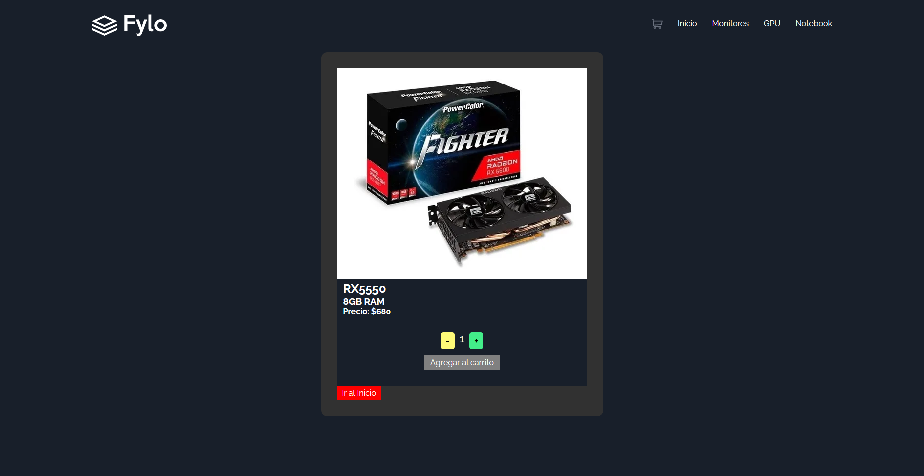
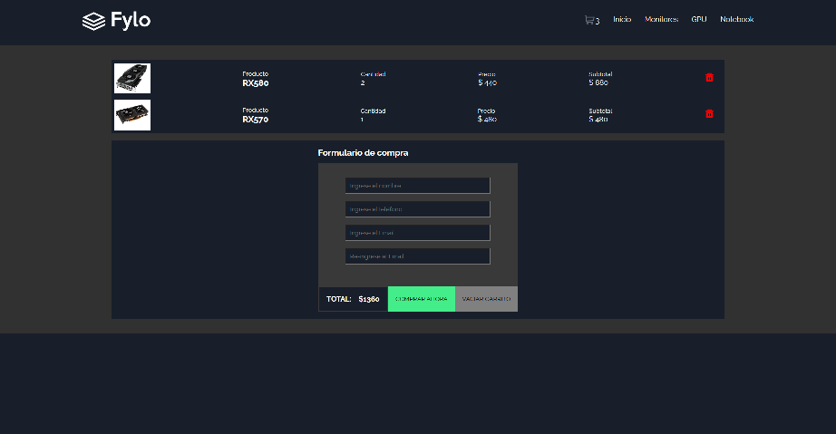

# Fylo Ecommerce
## Description
Fylo Ecommerce is an e-commerce platform for selling computer products. Users can browse through different products, view their descriptions, add them to their cart and verify the total cost of their purchase and quantity of items.

## Installation
(Not applicable for this project as it is a web application that can be accessed online)

## URL Deploy
https://entrega-final-react-kutzner.vercel.app/

## Screenshots

## Usage
To use Fylo Ecommerce, simply access the website through any web browser. You can then browse through the different products, view their descriptions and add them to your cart. When you're ready to checkout, you can verify the total cost of your purchase and the quantity of items in your cart.

## Features
- Wide variety of computer products.
- Detailed descriptions for each product.
- Easy navigation and search for products.
- Add products to cart and verify total cost and quantity of items.
- Secure payment platform.

## Contributors
- Martin Kutzner (Lead Developer)
- CoderHouse (Educational Institution)

## Credits
- Product images obtained from (Frontend Mentor)
- Icons used obtained from (React Icons)
